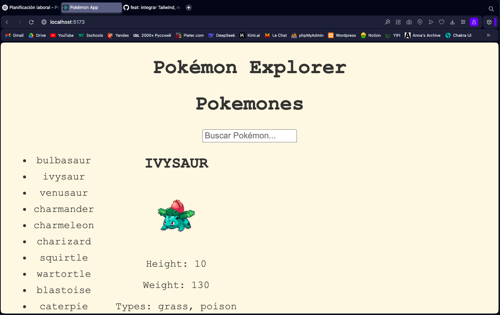

# PokéAPI Explorer

Una app web en React que muestra Pokémon usando la PokeAPI.

## Funcionalidades

- Buscar Pokémon por nombre
- Ver imagen al pasar el mouse
- Click para mostrar más información
- Estilo visual con Tailwind
- Corre con Docker

## Cómo usar

### Opción 1: con Docker

```bash
docker compose up --build

## 🖼️ Captura de pantalla


